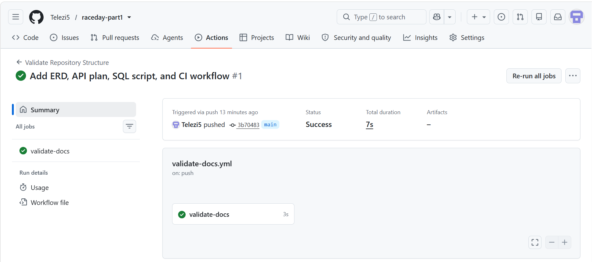

# RaceDay — Part 1: System Planning and Database

RaceDay is a full-stack event management platform for South African road running, walking, and cycling events. This repository contains the **Part 1 planning deliverables**: the data model, the API contract, and the database schema, all completed before any application code was written, as required by the brief.

---

## Repository Structure

```
├── README.md                      <- you are here
├── docs/
│   ├── raceday_erd.png            <- Section A: Entity Relationship Diagram
│   ├── api_endpoint_plan.md       <- Section B: API Endpoint Plan
│   ├── raceday_schema.sql         <- Section C: SQL Database Script
│   └── ci_build_screenshot.png    <- screenshot of a successful green GitHub Actions run
└── .github/
    └── workflows/
        └── validate-docs.yml      <- CI workflow that checks this structure on every push
```

---

## Section A — Entity Relationship Diagram

📄 `docs/raceday_erd.png`

The ERD models 6 entities: **Users, Events, Categories, Venues, Entries, Results.**

- `Users` holds both Organisers and Participants in a single table, distinguished by a `Role` column — this reflects the role-based design used throughout the system.
- `Entries` is the associative entity linking a Participant to a Category, resolving the many-to-many relationship between them.
- `Results` has a strict 1 : 0..1 relationship with `Entries` — a result only exists once a race has been completed.

**Design decision:** `Events` and `Venues` are modelled as a strict 1:1 relationship (one route record per event). If a future event needs multiple start points (e.g. different starts per category), this would need to change to 1:M in both the ERD and the SQL script.

---

## Section B — API Endpoint Plan

📄 `docs/api_endpoint_plan.md`

22 endpoints across the 6 required functional areas: Authentication, User Profile, Events, Categories, Event Enrolments, and Results. Every route, request body, and response code maps directly to a table/column in the ERD above.

**Design decisions:**
- Entries are nested under their parent Category (`/api/categories/{categoryId}/entries`) rather than exposed as a flat `/api/entries` resource, enforcing that an entry cannot exist without a category — matching the FK constraint in the SQL script.
- Results are captured and corrected by the **Organiser**, not self-reported by the Participant, to protect the integrity of race results.

This plan will be implemented as-is in Part 2. Any deviation between the implemented API and this plan will be explained here, in this section, at that time.

---

## Section C — SQL Database Script

📄 `docs/raceday_schema.sql`

A T-SQL script for Microsoft SQL Server (SSMS) that:
- Creates the `RaceDayDB` database (if it doesn't already exist)
- Creates all 6 tables from the ERD, with every primary key, foreign key, `NOT NULL`, `UNIQUE`, `DEFAULT`, and `CHECK` constraint defined
- Seeds the database with realistic sample data: 2 Organisers, 2 Participants, 3 Events, 2 Categories per event, a Venue per event, 4 sample Entries, and 2 sample Results

### How to run it
1. Open **SQL Server Management Studio (SSMS)** and connect to your local instance.
2. Open `docs/raceday_schema.sql`.
3. Click **Execute** (or press F5).
4. The script is written to be safely re-runnable — it drops and recreates the 6 tables each time, so running it twice will not cause errors.

---

## GitHub & CI/CD

- All planning documents live inside `/docs`, as required.
- A GitHub Actions workflow (`.github/workflows/validate-docs.yml`) runs on every push and checks that:
  - the `/docs` folder exists,
  - `raceday_erd.png`, `api_endpoint_plan.md`, and `raceday_schema.sql` are all present,
  - the SQL script is not empty,
  - a root-level `README.md` exists.

### CI Build Status



*(Replace this image with your own screenshot after your first successful Actions run — see setup instructions.)*

---

## Commit History

This repository was built with incremental, meaningful commits (20+) reflecting the actual order the planning work was done in — ERD first, then the API plan, then the SQL script, then CI setup — rather than a single bulk upload, so the history itself demonstrates the planning process.
